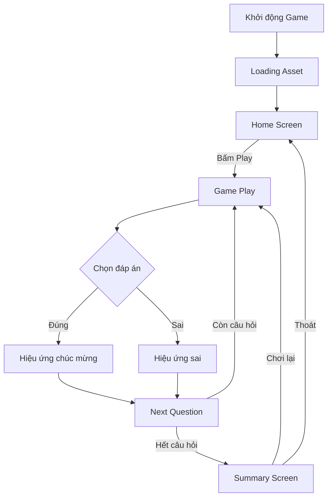

# Phân tích & Thiết kế Game Trắc nghiệm Chọn Đáp Án Đúng

## Mục tiêu game

Game giúp trẻ **rèn luyện kỹ năng nhận biết số từ 1–10** thông qua hình thức **trắc nghiệm chọn đáp án đúng** (ví dụ:“Có
bao nhiêu quả táo?”, “Chọn số đúng với hình bên”).  
Trẻ sẽ chọn một trong các đáp án hiển thị, được phản hồi ngay (đúng/sai) kèm hiệu ứng âm thanh – hình ảnh vui nhộn.

---

## I. Tổng quan cấu trúc hệ thống

Game được chia thành **các module chính** để dễ dàng mở rộng, tái sử dụng và sinh content tự động:

1. **Setting / Init Module**
    - Khởi tạo cấu hình game (ngôn ngữ, độ khó, số câu hỏi, asset pack).
    - Cấu hình thông tin người chơi (tên, avatar, cấp độ).
    - Thiết lập môi trường (canvas, âm thanh, độ phân giải, v.v.).

2. **Asset Loading Module**
    - Nạp tất cả tài nguyên cần thiết: hình ảnh, âm thanh, font, data câu hỏi.
    - Hỗ trợ preload và hiển thị thanh tiến trình loading.
    - Quản lý asset bằng key để dễ thay thế nội dung (ví dụ: đổi bộ chủ đề “trái cây” → “động vật”).

3. **Main Game Loop**
    - Chu trình chính điều khiển tiến trình game.
    - Gồm các trạng thái: *Init → Play → Feedback → Next Question → End*.
    - Quản lý thời gian, điểm, và vòng lặp render.

4. **Event Handler**
    - Xử lý sự kiện: nhấn nút, chọn đáp án, chuyển màn, thoát game.
    - Cung cấp cơ chế lắng nghe sự kiện để các thành phần khác đăng ký.

5. **User Input Handler**
    - Xử lý thao tác người chơi: click, chạm, kéo thả (nếu có).
    - Chống spam – debounce click, giới hạn thao tác trong giai đoạn feedback.

6. **Animation System**
    - Quản lý hiệu ứng: khi chọn đúng/sai, khi chuyển câu, khi nhận thưởng.
    - Có thể tái sử dụng bằng cách gán animation ID cho từng loại hành động.

---

## II. Cấu trúc các màn hình chính

| **Màn hình**                            | **Mô tả / Chức năng**                                                                                  | **Tương tác chính**                            |
|-----------------------------------------|--------------------------------------------------------------------------------------------------------|------------------------------------------------|
| **1. Splash / Loading Screen**          | Hiển thị logo, thanh tiến trình khi tải tài nguyên.                                                    | Không tương tác hoặc chạm để tiếp tục.         |
| **2. Home Screen**                      | Chọn chế độ chơi (ví dụ: “Đếm số”, “Nhận biết chữ”), xem điểm cao, truy cập cài đặt.                   | Nút *Play*, *Settings*, *Exit*.                |
| **3. Settings Screen**                  | Điều chỉnh âm lượng, tốc độ, chủ đề, ngôn ngữ.                                                         | Bật/tắt âm, chọn theme, chọn độ khó.           |
| **4. Game Play Screen**                 | Màn hình chính của trò chơi. Hiển thị câu hỏi, hình ảnh, 3–4 lựa chọn.                                 | Chọn đáp án, xem phản hồi, chuyển câu kế tiếp. |
| **5. Feedback Popup / Animation Layer** | Hiển thị kết quả chọn đúng hoặc sai. Có thể có âm thanh, sao thưởng, hoặc animation động vật vui nhộn. | Xem hiệu ứng và bấm “Tiếp tục”.                |
| **6. Result / Summary Screen**          | Hiển thị tổng kết: điểm số, số câu đúng, huy hiệu đạt được.                                            | Nút *Chơi lại*, *Trang chủ*.                   |

---

## III. Cấu trúc dữ liệu cơ bản

### 1. Câu hỏi (Question Object)

```json
{
  "id": 1,
  "question_text": "Có bao nhiêu quả táo trong hình?",
  "image": "apple_5.png",
  "choices": [
    3,
    5,
    7
  ],
  "answer": 5,
  "feedback_correct": "Rất giỏi! Có 5 quả táo 🍎",
  "feedback_wrong": "Sai rồi, đếm lại nhé!"
}
```

### 2. Cấu hình game (GameConfig)

```json
{
  "language": "vi",
  "difficulty": "easy",
  "num_questions": 10,
  "theme": "fruit",
  "sound_enabled": true
}
```

### 3. Trạng thái game (GameState)

```json
{
  "current_question_index": 3,
  "score": 20,
  "lives": 2,
  "game_over": false
}
```

---

## IV. Thiết kế hướng tái sử dụng

Mục tiêu là **tách riêng nội dung (content)** khỏi **logic game**, để có thể tạo game mới bằng cách chỉ thay đổi *
*data + asset**.

### 1. Phân tầng module

- **Core Engine:** Xử lý vòng đời game, event, render.
- **UI Layer:** Quản lý layout, nút bấm, feedback.
- **Content Layer:** Chứa dữ liệu câu hỏi, hình ảnh, âm thanh.

### 2. Quy tắc tái sử dụng

- Mỗi loại game (ví dụ: “Chọn số đúng”, “Ghép chữ đúng”) chỉ cần đổi **Question JSON + Asset pack**.
- Animation, âm thanh, hiệu ứng chung nằm trong thư viện core.
- Cấu hình có thể tự động sinh dựa theo `GameConfig` (ví dụ độ khó ảnh hưởng số đáp án).

---

## V. Luồng hoạt động tổng quát



---

## VI. Gợi ý kỹ thuật

- **Engine đề xuất:** Phaser.js, PixiJS.
- **Dạng asset:** PNG/JPG cho hình, JSON cho dữ liệu, MP3/OGG cho âm thanh.
- **Tương thích:** Web, App.

---
